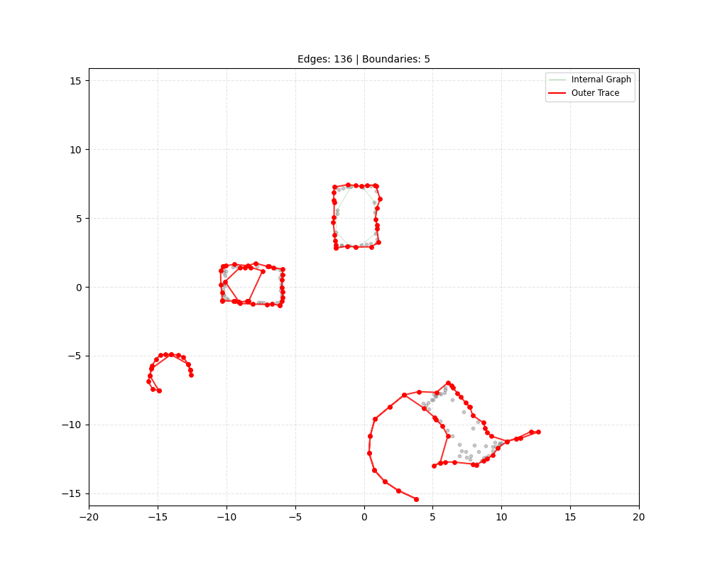

# LIDAR Boundary Tracer



Builds a spatial graph using a rolling ball criterion, and traces the outer boundaries using a wall-following algorithm.

Includes an example with synthetic lidar point data.

## Setup

```bash
pip install -r requirements.txt
```

## Run

```bash
python main.py
```

## Usage

- A window will open showing the generated LIDAR scene.
- **Red lines** represent the detected outer boundaries.
- **Green lines** represent the internal graph connections.
- **Press `Enter`** in the plot window to generate a new random scene.
